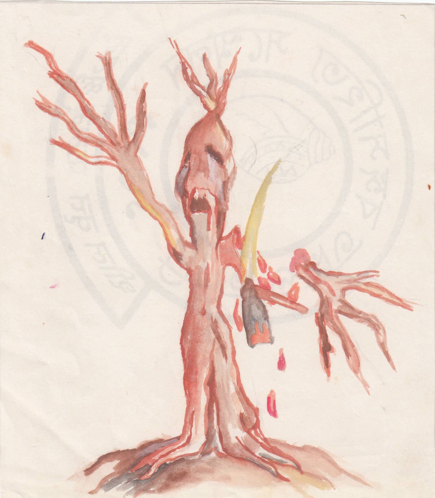

# আর্তনাদ

<figure><figcaption></figcaption></figure>

### এক 

হুস করে একটা ম্যাক্স আমার পাশ কেটে চলে গেল। পাশের নদীতে চাঁদের ছায়া নড়াচড়া করছে। নদীর ওপাশে দেখা যাচ্ছে দুটি ছোট কুঁড়েঘর। ওই ঘরগুলোর পিছন দিকে আছে বেশ কতকগুলো তালগাছ। ওই তালগাছগুলোর পাতার ফাঁকে ফাঁকে দেখা যাচ্ছে চাঁদ। আজ চতুর্দশী না পূর্ণিমা বুঝতে না পারলেও নীলচে জ্যোৎস্না যেন সব কিছু রহস্যময় করে রেখেছে। তাই দূরের জিনিসগুলো ভালো করে দেখা যাচ্ছে না। মেঠো পথটি সামনের দিকে এঁকেবেঁকে চলে গেছে।

ম্যাক্সটিকে আর দেখা গেলো না। শুধু পেছনের লাল টকটকে আলোটুকু চোখে এসে পড়ছে।

উচ্চমাধ্যমিক পরীক্ষা দিয়ে আমি এসেছি এই গাঁয়ে বেড়াতে। এখানে আমার মামার বাড়ি। এরপর আমার জীববিজ্ঞান নিয়ে পড়ার ইচ্ছে। আমি এখানে একটু ঘুরতে বেরিয়েছি একা। চারিদিক দেখতে দেখতে আমার একটু খটকা লাগল। নদীর ওপাশে ঘর কয়েকটি থাকলেও এ পাশে একটাও নজরে এলো না। বেশ ঠাণ্ডা লাগছে। চাঁদের আলোয় নদীর চর চিকমিক করছে।

হঠাৎ শুনতে পেলাম একটা জোরালো অথচ মিহি চিৎকারের আওয়াজ। এপাশের জঙ্গল থেকে আসছে। আমার গায়ে কাঁটা দিয়ে উঠল। কোথা থেকে এল শব্দটা? কীসের আওয়াজ? এসব ভাবতে ভাবতে যখন চারদিক তাকাতে লাগলাম তখন আবার ওরকম চিৎকার শুনলাম। দূরে জঙ্গলের মধ্যে কী যেন একটা নড়াচড়া করছে। পাতায় খসখস শব্দ উঠছে। আমি কৌতূহল চেপে রাখতে পারলাম না। কী থাকতে পারে ওখানে — ভেবে ওদিকে হাঁটা শুরু করলাম।

এদিকটা একটু চড়াই। তবে হাঁটতে কোনও অসুবিধা নেই।

হাঁটতে হাঁটতে সম্ভবত ওই জায়গায় এসে পড়লাম যেখান থেকে শব্দ শোনা যাচ্ছিল। আসতে বেশ ভয় ভয়ই করছিল। যদি নেকড়ে-টেকড়ে থাকতো! কিন্তু না, এসে দেখলাম কিছুই নেই। শুধু সামনে একটা বিশাল জামগাছ। আশ্চর্যভাবে বেঁকে রয়েছে। কিন্তু এমনি দেখলে বাঁকা বোঝা যায় না।

আমি গাছটি ভালোভাবে নিরীক্ষণ করতে লাগলাম। দেখি গাছের পেটে বিশাল গর্ত। আর গাছের একটি ডালের ছাল যেন একটু কুঁচকে রয়েছে। এটাই আশ্চর্য লাগল আমার। রাতে আর অত বেশি কিছু দেখতে পাইনি। বেশ কিছুক্ষণ ওখানে দাঁড়িয়ে এপাশ ওপাশ তাকালাম।

শেষে হতাশ হয়ে পা বাড়ালাম রাস্তার দিকে।

### দুই 

ঘাসে ঘাসে শিশির লেগে রয়েছে। ভোর ভোর, সূর্য এখনো ওঠেনি। পুবদিকের নারকেল গাছগুলোর পিছনটা লাল হয়েছে। আকাশে হালকা চাঁদ এখনো চোখে পড়ছে। একটু বেড়িয়ে আসবার অনুমতি নিয়ে এসেছি ওখানে যাবার জন্য। হয়তো অনুমতি না দিলেও আসতাম, রহস্যটা তো আমাকে জানতেই হবে।

এক ঝাঁক পাখি কিচিরমিচির করে আমার মাথার উপর দিয়ে উড়ে গেল। সকালের এই মনোমুগ্ধকর পরিবেশে এতদূর হেঁটেও কোনও ক্লান্তি অনুভব করলাম না। হাঁটতে হাঁটতে সম্ভবত ওই জায়গায় এসে পড়েছি যেখান থেকে কাল জঙ্গলে ঢুকেছিলাম। ঠিক কোন জায়গাটা থেকে গিয়েছিলাম ভুলে গেছি। তবু জঙ্গলে ঢুকে পড়লাম। এত বড় জঙ্গলে জামগাছটি খুঁজে পাওয়া যে খুব সোজা নয়, সে আমি জানি।

### **তিন** 

আধঘণ্টার মধ্যেই আমি গাছটি খুঁজে পেলাম। ততক্ষণে সকাল হয়ে গেছে। পাতার ফাঁক দিয়ে সূর্যের আলো আমার হাতে এসে লাগল। জাম গাছটা দেখেই আমি আশ্চর্য হয়ে যাই। টপটপিয়ে উপর থেকে দু-ফোঁটা জল পড়ল আমার গায়ে। কাল যে দেখেছিলাম কুঁচকানো ছাল, আজ তা মসৃণ। অথচ গাছটি ঠিক ওইটাই, আমি জানি। কারণ, ওর পেটের বিশাল গর্তটা দেখেই চেনা যাচ্ছে। কাল কান্ডটা একটু নীচের দিকে ছিল, আজ একটু উপরে বোধ হলো। আমি তো বিস্ময়ে হতবাক।

আমি গাছটিতে হাত বোলাতে লাগলাম। অনুভব করলাম এ যেন সাধারণ কোনো গাছের ছাল নয়। কোনো প্রাণীর মতো ত্বক — অথচ!

হঠাৎ কে যেন আমার কাঁধে হাত রাখল। এই রকম পরিবেশে আচমকা কেউ হাত রাখায় আমি প্রায় আঁতকে উঠলাম। ফিরে দেখি চশমা নাকে এক প্রৌঢ়। মুখে হালকা গোঁফ-দাড়িও। পরনে ধুতি পাঞ্জাবি। তিনি প্রথমে আমার নাম জিজ্ঞেস করলেন। এরপর তাঁর সঙ্গে আলাপ হলো। তিনি গ্রামের হাইস্কুলের বিজ্ঞান শিক্ষক। তিনি আমাকে অনেক কিছু জিজ্ঞেস করার পর বললেন, একটু আসবেন আমার সঙ্গে!

তিনি আমাকে উত্তর দিকে নিয়ে যেতে থাকলেন। ক্রমশ ঘন হয়ে আসছে জঙ্গল। এক জায়গায় এসে দেখি এত ঝোপঝাড় যে আর এগোনোই যায় না। সকাল গড়িয়ে গেছে, তবু এখানে আলোর নাম গন্ধই নেই। এই ঘন জঙ্গলের ভেতর সূর্যের আলো পৌঁছতেই পারছে না।

বনগুলো যেন আবৃত করে রেখেছে অজানা রহস্যকে। একটা ছোট্ট ফাঁক আছে ওদিকে যাবার জন্য। আমি ওঁর দিকে চেয়ে ওই ফাঁক দিয়ে ভেতরে ঢুকে যাই।

দেখি বেশ বড় একটি গর্ত। আমি অবাক! তিনি আমাকে নিয়ে গর্তের ভেতর ঢুকলেন। ভেতরে রয়েছে ছোট্ট একখানি ঘরের মতো জায়গা। ছোট বিছানা, চেয়ার-টেবিল, আর কিছু গবেষণা সামগ্রী। তিনি কালো রঙের ট্রাঙ্কের মতো কী যেন একটা বের করে আনলেন।

আমি জিজ্ঞেস করলাম, ওটা কী?

তিনি জবাব দিলেন ওটা তাঁর সারা জীবনের গবেষণার ফসল। তিনি ছোট থাকতেই গাছপালাদের খুব ভালোবাসতেন। কাউকে গাছ কাটতে দিতেন না। কিন্তু দশ-বিশ বছর আগে থেকে প্রচণ্ডভাবে গাছ কাটা শুরু হয়। কিলোমিটারের পর কিলোমিটার বনজঙ্গল লুপ্ত হয়ে যায়। তাঁর চোখের সামনেই কেটে নেওয়া হয় হাজার হাজার গাছ। তিনি ভাবলেন, যদি তাদের প্রতিবাদ করার ক্ষমতা থাকত, তাহলে লোকে গাছ কাটতে পারত না। তাই তিনি বিশ বছর বয়স থেকে কাজের ফাঁকে ফাঁকে চালিয়েছেন গবেষণা।

### চার 

মানুষ যেভাবে নিজেদের মধ্যে কথা বলে, গাছেরাও সম্ভবত সেইভাবে একে অন্যের সঙ্গে কথা বলে। অবশ্য তা আমরা শুনতে পাই না, কারণ ওরা অতিশাব্দিক সংকেত পাঠায় একে অন্যকে। এখন বিজ্ঞানীরাও তা বিশ্বাস করতে শুরু করেছেন। এই কথা ভেবেই তিনি দীর্ঘ ত্রিশ বছর ধরে বনে-জঙ্গলে থেকে গাছেদের বুঝে, অবশেষে এই যন্ত্র আবিষ্কার করেছেন। এই যন্ত্র গাছেদের দেওয়া অতিশাব্দিক সংকেত গ্রহণ করতে পারে।

তিনি এই অতি শব্দের আওয়াজ শুনলেন ও তার ফলে গাছেদের কী রকম পরিবর্তন হয় তাও প্রত্যক্ষ করে দেখবার চেষ্টা করলেন। এসব দেখে শুনে তিনি এমন এক প্রকার অতিশব্দের আবিষ্কার করে ফেললেন যা গাছের উত্তেজনা প্রচণ্ড পরিমাণে বাড়িয়ে দেয়। যাতে গাছ প্রতিবাদ করার শক্তি পায়।

আমি থ হয়ে দাঁড়িয়ে রইলাম, কী শুনছি বিশ্বাস করতে পারছি না। বছরখানেক ওই শব্দ অনবরত পাঠাবার পর গাছগুলোর ওপর এর প্রভাব পড়তে শুরু করেছে দিন পনেরো আগে থেকে। তারা নিজে নড়াচড়ার চেষ্টা করছে। রাতে প্রায়ই তারা এই চেষ্টা করে, তাই আমি কাল রাতে গাছের চিৎকার শুনতে পেয়েছিলাম…

যন্ত্র থেকে অনবরত অতিশব্দ বেরিয়ে আসছে।

হঠাৎ যেন অন্ধকার নেমে এল। চারিদিক নিঝুম। পাখির টুঁ শব্দটি পর্যন্ত নেই।

আস্তে আস্তে গাছগুলো যেন সবাই সজীব হয়ে উঠছে। তাদের পাতা, ডাল, কাণ্ড সব কিছু সঞ্চালনের চেষ্টা করছে। এসব করতে তাদের ভীষণ কষ্ট লাগাটাই স্বাভাবিক। আর তাই তারা অনবরত চিৎকার করে চলছে…

এমন সময় আমি চেয়ে দেখি লোকটি নেই।

কারা যেন বলছে, আমাদের মেরো না, আমাদের মেরো না,

আমার বুক ধুকধুক করতে লাগল, রক্ত জল হয়ে এলো…

### পাঁচ 

হঠাৎ টুপ করে এক ফোঁটা জল পড়ল মাথায়। আরে! আমি কোথায়…

সেই গাছগুলো, সেই লোকটি, যন্ত্র। আমি তো ওই জামগাছের নীচেই দাঁড়িয়ে আছি। এতক্ষণ যা কিছু দেখলাম তা কি সত্যি, না একটা নিছক ভাবনা!

তাহলে আমার শরীরটা ওরকম করছে কেন? গাছেরা মুখর হয়ে উঠেছিল বলেই তো আমার হৃদয়ে এখনো বাজছে সেই আর্তনাদের ভাষা! ওদের অনুভূতিময় হৃদয় থেকেই হয়তো ভাষা-তরঙ্গ আমার বুকের নরম ভালোবাসার তারে আঘাত করেছে। না হলে জামগাছটি বিনা বাতাসে অমন করে দুলছে কেন। পাতার গুচ্ছ নিয়ে ডালগুলো আমার কাছে কেমন নুয়ে পড়ছে।

আমার গা শিহরিত হয়ে উঠল। আমি অসহ্য আবেগে জামগাছটিকে জড়িয়ে ধরে চিৎকার করে উঠলাম,

ওহে কে আছ, গাছগুলোকে বাঁচাও…
